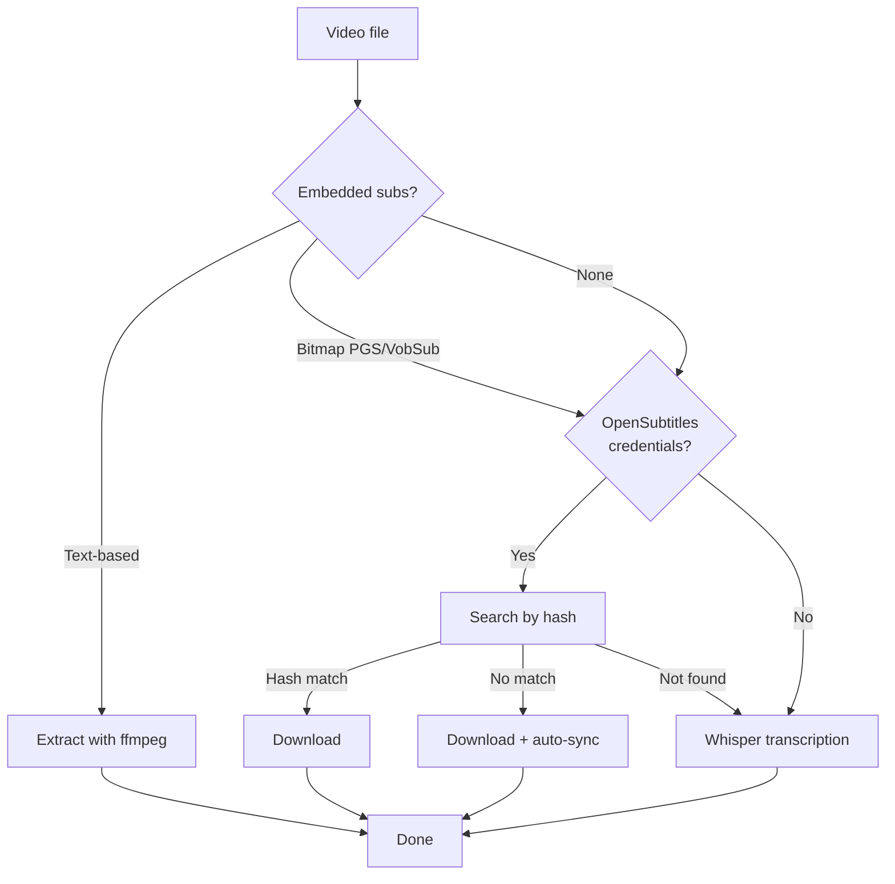

# subtitle-tool

Extract, transcribe, translate, or download subtitles for video files.

## Features

- **Extract** embedded SRT subtitles from video files (via ffmpeg)
- **Transcribe** audio to subtitles with faster-whisper (GPU-accelerated)
- **Translate** SRT files between languages (local or cloud — 10 backends)
- **Download** Swedish and English subtitles from OpenSubtitles.com
- **Sync** existing SRT files to video audio (via ffsubsync)
- **Batch mode** - process all video/SRT files in a directory

## Requirements

- Python 3.10+
- ffmpeg and ffprobe
- [faster-whisper](https://github.com/SYSTRAN/faster-whisper) (for transcription)
- [ffsubsync](https://github.com/smacke/ffsubsync) (for sync)
- CUDA-compatible GPU (recommended for Whisper, CPU mode available via `--device cpu`)

```
pip install -r requirements.txt
```

## API keys

Some features require API keys, which are read from environment variables.
**Never put API keys directly in commands or scripts.**

### Translation backends - for `--translate-subs`

Translation uses **Mistral** by default (free, great quality, 1B tokens/month).
Set `MISTRAL_API_KEY` to get started, or use `--translate-backend helsinki` for fully offline translation:

| Backend | Quality | Speed | Cost | Setup |
|---|---|---|---|---|
| `mistral` | Great | Fast | Free tier (1B tokens/mo) | API key (default) |
| `groq` | Great | Very fast | Free tier (100K tokens/day) | API key |
| `helsinki` | Good (basic MT) | Fast (local) | Free | None (offline) |
| `ollama` | Good-Great | Medium (local) | Free | Install Ollama |
| `claude-code` | Excellent | Fast | Included in subscription | Install Claude Code |
| `gemini` | Great | Fast | Free tier (1K req/day) | API key |
| `github` | Great | Fast | Free tier (150 req/day) | GitHub token |
| `openrouter` | Great | Fast | Free models available | API key |
| `deepseek` | Great | Fast | Trial credits (30 days) | API key |
| `openai` | Excellent | Fast | Paid | API key |
| `claude` | Excellent | Fast | Paid | API key |

#### Claude Code (uses your Claude subscription)

If you have a Claude Pro/Max subscription and Claude Code installed, you can
translate using your existing subscription — no API key needed:

```bash
npm install -g @anthropic-ai/claude-code
claude auth login
# That's it — now use --translate-backend claude-code
```

#### Getting free API keys

**Groq** (recommended cloud option — fastest, generous free tier):
1. Sign up at [console.groq.com](https://console.groq.com/) (no credit card)
2. Create an API key
3. `export GROQ_API_KEY="gsk_..."`

**Google Gemini:**
1. Go to [aistudio.google.com](https://aistudio.google.com/) (no credit card)
2. Get an API key
3. `export GEMINI_API_KEY="AI..."`

**GitHub Models** (use your existing GitHub account):
1. Create a personal access token at [github.com/settings/tokens](https://github.com/settings/tokens) with `models:read` permission
2. `export GITHUB_TOKEN="ghp_..."`

**Mistral:**
1. Sign up at [console.mistral.ai](https://console.mistral.ai/) (no credit card)
2. Create an API key
3. `export MISTRAL_API_KEY="..."`

**OpenRouter:**
1. Sign up at [openrouter.ai](https://openrouter.ai/) (no credit card for free models)
2. Create an API key
3. `export OPENROUTER_API_KEY="sk-or-..."`

**DeepSeek** (30-day trial credits):
1. Sign up at [platform.deepseek.com](https://platform.deepseek.com/) (no credit card)
2. Create an API key
3. `export DEEPSEEK_API_KEY="sk-..."`

**OpenAI** (paid):
1. Sign up at [platform.openai.com](https://platform.openai.com/)
2. Create an API key
3. `export OPENAI_API_KEY="sk-..."`

**Anthropic Claude** (paid):
1. Sign up at [console.anthropic.com](https://console.anthropic.com/)
2. Create an API key
3. `export ANTHROPIC_API_KEY="sk-ant-..."`

For fish shell, use `set -Ux VAR_NAME "value"` instead of `export`.
For Windows PowerShell: `[Environment]::SetEnvironmentVariable("VAR_NAME", "value", "User")`

### Hugging Face (optional) - for faster Whisper model downloads

Whisper models are downloaded from Hugging Face Hub on first run. Setting a
token removes rate limits and speeds up downloads. Without a token you may see
a warning — this is harmless, downloads still work.

1. Create an account at [huggingface.co](https://huggingface.co/)
2. Go to **Settings > Access Tokens** and create a token
3. Set the environment variable:

```bash
# bash / zsh (~/.bashrc or ~/.zshrc)
export HF_TOKEN="hf_..."

# fish (~/.config/fish/config.fish)
set -Ux HF_TOKEN "hf_..."

# Windows (PowerShell, permanent for current user)
[Environment]::SetEnvironmentVariable("HF_TOKEN", "hf_...", "User")
```

### OpenSubtitles - for subtitle downloads

1. Create an account at [opensubtitles.com](https://www.opensubtitles.com/)
2. Go to [API consumers](https://www.opensubtitles.com/en/consumers) and register an app
3. Set the environment variables:

```bash
# bash / zsh (~/.bashrc or ~/.zshrc)
export OPENSUBTITLES_API_KEY="your-api-key"
export OPENSUBTITLES_USERNAME="your-username"
export OPENSUBTITLES_PASSWORD="your-password"

# fish (~/.config/fish/config.fish)
set -Ux OPENSUBTITLES_API_KEY "your-api-key"
set -Ux OPENSUBTITLES_USERNAME "your-username"
set -Ux OPENSUBTITLES_PASSWORD "your-password"

# Windows (PowerShell, permanent for current user)
[Environment]::SetEnvironmentVariable("OPENSUBTITLES_API_KEY", "your-api-key", "User")
[Environment]::SetEnvironmentVariable("OPENSUBTITLES_USERNAME", "your-username", "User")
[Environment]::SetEnvironmentVariable("OPENSUBTITLES_PASSWORD", "your-password", "User")
```

All three are required. When configured, OpenSubtitles downloading is automatically
included in the default processing pipeline (extract → download → whisper).

## Usage

### Default processing order

When you run `python subtitle_tool.py video.mkv`, the tool tries these steps in order:



Directories are searched recursively, so you can point it at a whole library.

```bash
# Single file
python subtitle_tool.py video.mkv

# Entire library (recursive)
python subtitle_tool.py /path/to/movies/

# Force Whisper, skip extract and download steps
python subtitle_tool.py --only-whisper video.mkv

# Specify language and model
python subtitle_tool.py -l sv -m large-v3 video.mkv

# Overwrite existing subtitle files
python subtitle_tool.py --force video.mkv

# Run on CPU (no GPU required, slower)
python subtitle_tool.py --device cpu video.mkv

# Use a smaller model (less VRAM / faster on CPU)
python subtitle_tool.py -m medium video.mkv
python subtitle_tool.py -m small video.mkv

# Use float16 precision (better quality, needs more VRAM)
python subtitle_tool.py --compute-type float16 video.mkv
```

If Whisper runs out of GPU memory, it automatically falls back to CPU.

### Translate subtitles

Translate SRT files between languages. Uses Helsinki (local, free) by default.
No API key or internet required for the default backend.

```bash
# Translate English SRT to Swedish (Mistral, free — default)
python subtitle_tool.py --translate-subs movie.en.srt --to sv .

# Use Helsinki for offline translation (no API key needed)
python subtitle_tool.py --translate-subs movie.en.srt --to sv --translate-backend helsinki .

# Use Gemini
python subtitle_tool.py --translate-subs movie.en.srt --to sv --translate-backend gemini .

# Use local Ollama
python subtitle_tool.py --translate-subs movie.en.srt --to sv --translate-backend ollama .

# Use Claude Code (uses your Claude subscription, no API key needed)
python subtitle_tool.py --translate-subs movie.en.srt --to sv --translate-backend claude-code .

# Use Claude API (paid, requires API key)
python subtitle_tool.py --translate-subs movie.en.srt --to sv --translate-backend claude .

# Override the model for any backend
python subtitle_tool.py --translate-subs movie.en.srt --to sv --translate-backend groq --translate-model llama-3.1-8b-instant .

# Batch - translate all SRT files in a directory
python subtitle_tool.py --translate-subs /path/to/subs/ --to sv .
```

Output filename is determined automatically: `movie.en.srt` becomes `movie.sv.srt`.
The source language is detected from the filename (e.g., `.en.srt` = English).
If a matching video file is found, translated subtitles are auto-synced to the audio.

### Download from OpenSubtitles.com

Downloads both Swedish (.sv.srt) and English (.en.srt) subtitles.
Requires OpenSubtitles credentials (see above).

OpenSubtitles downloading is automatically included in the default processing order
when credentials are configured. You can also run it standalone:

```bash
# Download only (no extract/whisper)
python subtitle_tool.py --opensubtitles video.mkv

# Batch - all files in a directory (recursive)
python subtitle_tool.py --opensubtitles /path/to/videos/
```

If the file hash matches on OpenSubtitles, subtitles are downloaded directly.
If the hash does not match, subtitles are downloaded and automatically synced
to the video audio via ffsubsync.

### Sync subtitles

```bash
# Sync an SRT file to the video's audio (overwrites the original)
python subtitle_tool.py video.mkv --sync subtitle.srt

# Save to a different file instead
python subtitle_tool.py video.mkv --sync subtitle.srt -o synced.srt
```

## Installation with uv (recommended)

The easiest way to run subtitle_tool is with [uv](https://docs.astral.sh/uv/).
No venv, no pip install — uv reads the inline dependency metadata from the
script's shebang and handles everything automatically.

1. Install uv:

```bash
# Linux / macOS
curl -LsSf https://astral.sh/uv/install.sh | sh

# Windows (PowerShell)
powershell -ExecutionPolicy ByPass -c "irm https://astral.sh/uv/install.ps1 | iex"

# Or via package managers
pacman -S python-uv          # Arch / CachyOS
brew install uv               # macOS
```

2. Make the script executable and run it directly:

```bash
chmod +x subtitle_tool.py
./subtitle_tool.py --help

# Or copy/symlink to PATH
sudo cp subtitle_tool.py /usr/local/bin/subtitle_tool
subtitle_tool video.mkv
```

On first run, uv automatically downloads the correct Python version (if needed)
and installs all dependencies into a cached environment. Works on Linux, macOS,
and Windows.

## Building a standalone binary (alternative)

If you prefer a single executable without requiring uv or Python on the target
machine, you can build one with PyInstaller:

```bash
# Create a venv and install everything
python -m venv .venv
source .venv/bin/activate        # bash/zsh
# source .venv/bin/activate.fish  # fish
# .venv\Scripts\activate          # Windows

pip install faster-whisper ffsubsync pyinstaller

# Build single-file binary
pyinstaller --onefile subtitle_tool.py

# The binary is now in dist/
./dist/subtitle_tool --help
```

> **Note:** The binary will be large (~1.2-1.4 BB) because it bundles the Python
> runtime and all dependencies including CUDA/cuDNN libraries from faster-whisper.
> Whisper model files are **not** included — they are downloaded on first run.
> ffmpeg/ffprobe and ffsubsync must still be installed separately on the system.

## Supported formats

Video: .mkv, .mp4, .avi, .webm, .mov, .ts
